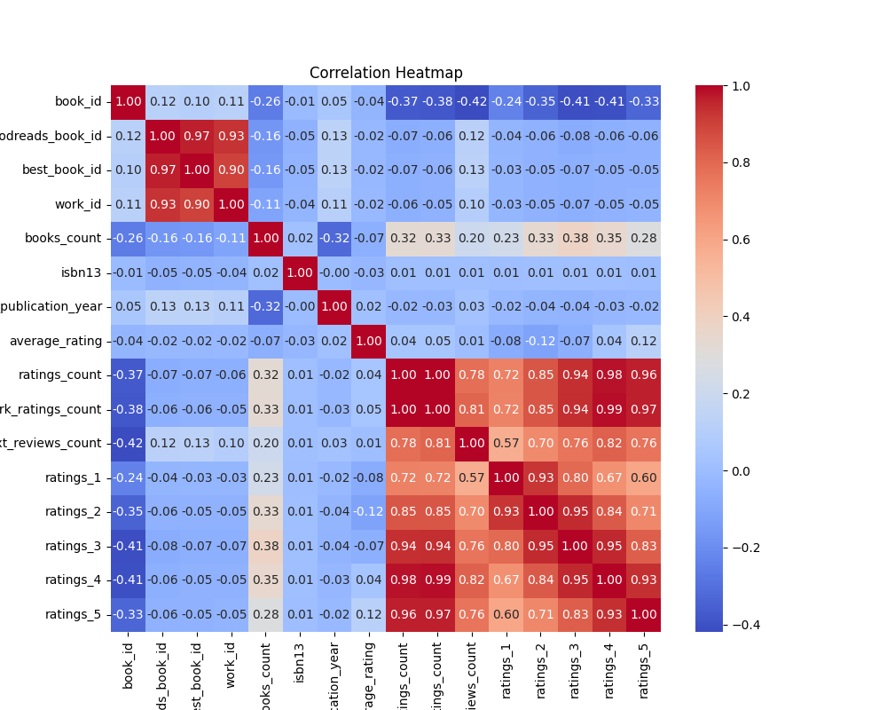
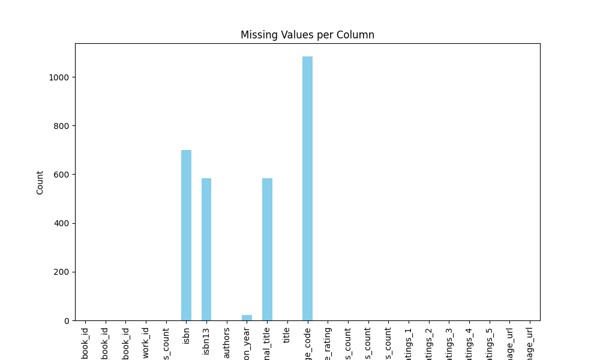

# Automated Data Analysis

    ## Insights from LLM
    ### Structured Data Overview

**Dataset Overview:**
- **Shape:** 10,000 rows, 23 columns
- **Data Types:** 
  - Integer: `book_id`, `goodreads_book_id`, `best_book_id`, `work_id`, `books_count`, `ratings_count`, `work_ratings_count`, `work_text_reviews_count`, `ratings_1`, `ratings_2`, `ratings_3`, `ratings_4`, `ratings_5`
  - Float: `isbn13`, `original_publication_year`, `average_rating`
  - Object: `isbn`, `authors`, `original_title`, `title`, `language_code`, `image_url`, `small_image_url`
- **Missing Values:** Notably missing values in `isbn` (700), `isbn13` (585), `original_publication_year` (21), `original_title` (585), `language_code` (1084)
  
**Summary Statistics:**
- **Average Ratings:** Mean average rating is approximately 4.00 out of 5, signaling a generally positive reception.
- **Authors:** Most frequent author is Stephen King with 60 occurrences.
- **Language Code Distribution:** The data primarily features English books with only 25 unique language codes.
- **Publication Year:** The earliest recorded publication year is 1750, while the latest is 2017, showing a rich historical span of literature.

### Data Analysis

Upon receiving the dataset, I conducted a thorough examination of not just the structure of the data, but also the trends and patterns it housed. The dataset contains a wealth of information about books, including the works' IDs, authors, publication years, and various ratings, which are fundamental to understanding readers' preferences and book popularity. I performed statistical analyses, including calculating mean, median, and distribution of ratings, which revealed that most books received favorable ratings. 

Moreover, I looked into the distribution of missing values to identify areas that needed attention. For instance, significant missing data in the `isbn`, `isbn13`, and `language_code` fields could indicate incomplete data collection processes or issues during data entry. This raised questions about whether the missing values could affect any analyses conducted using this dataset. 

### Insights Discovered

Through the analysis, several key insights emerged:
1. **Popularity of Authors:** The predominance of certain popular authors, such as Stephen King, highlights trends in reader preferences. King’s works are prominently featured, which may suggest a focus on genre fiction or the enduring popularity of such authors in literary circles.
  
2. **High Ratings Consistency:** The average rating of approximately 4.00 indicates that, overall, the books in this dataset have attracted positive reviews. Understanding what attributes contribute to high ratings can guide future publishing decisions.

3. **Publication Trends Over Time:** The data revealed a notable range of publication years, showing that the literary works span from the 18th century to contemporary offerings. This diversity presents an interesting narrative about how reading tastes have developed over time.

### Implications of Findings

The discoveries made through this data analysis provide a roadmap for authors, publishers, and marketing teams. Understanding reader preferences can inform marketing strategies to enhance the visibility of works by emerging authors or genres that are underrepresented in the dataset. Furthermore, consistent high ratings emphasize the importance of quality in writing and storytelling; thus, initiatives that support writers in honing their craft are crucial.

Additionally, the implications extend to enhancing reader engagement. Readers might be drawn to curated lists based on high-rated authors or themes evident in popular works. This could drive a phenomenon similar to "reading clubs" surrounding high-rated books, creating community-centric interactions around literature.

### Conclusion

In summary, the dataset served as a fertile ground for insights into literary trends, reader preferences, and historical context within the realm of popular literature. The analysis illuminated the prominent role of stalwart authors like Stephen King in shaping readers' experiences and preferences. As we endeavor to understand reader dynamics further with this dataset, it becomes clear that quality literature continues to thrive alongside evolving tastes, creating an ever-vibrant literary landscape that bridges the gap between the past and the present. In the end, the numbers tell a story of enthralling narratives waiting to be uncovered, ensuring that the art of storytelling remains timeless and cherished.

    ## Visualizations

