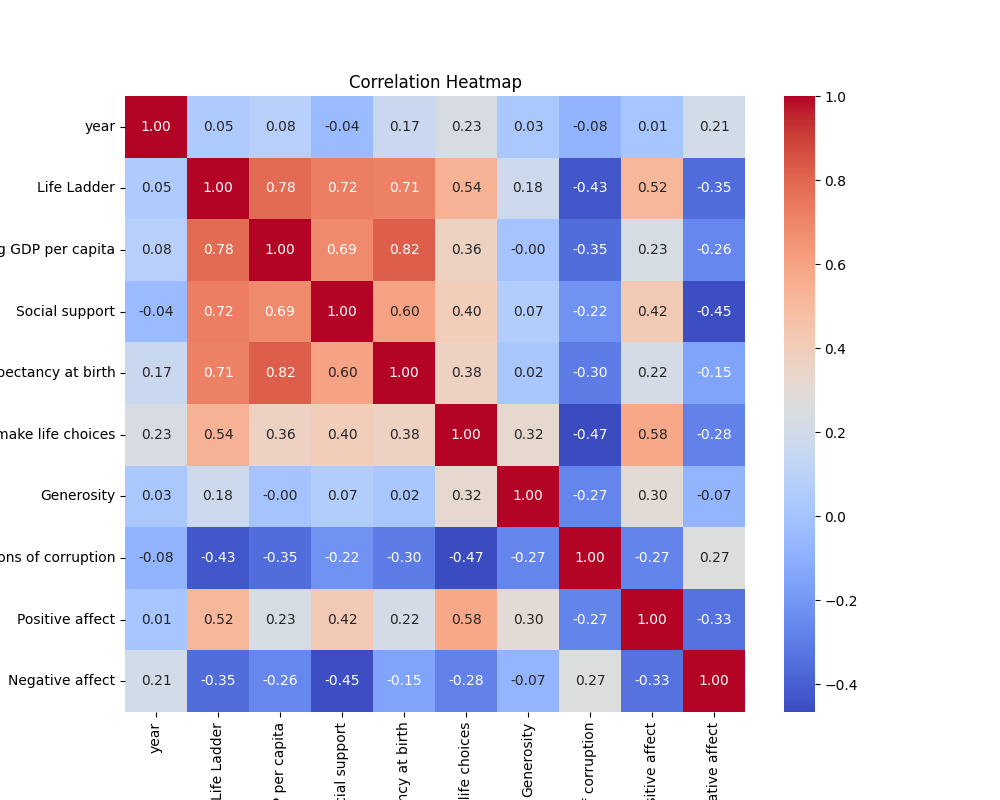
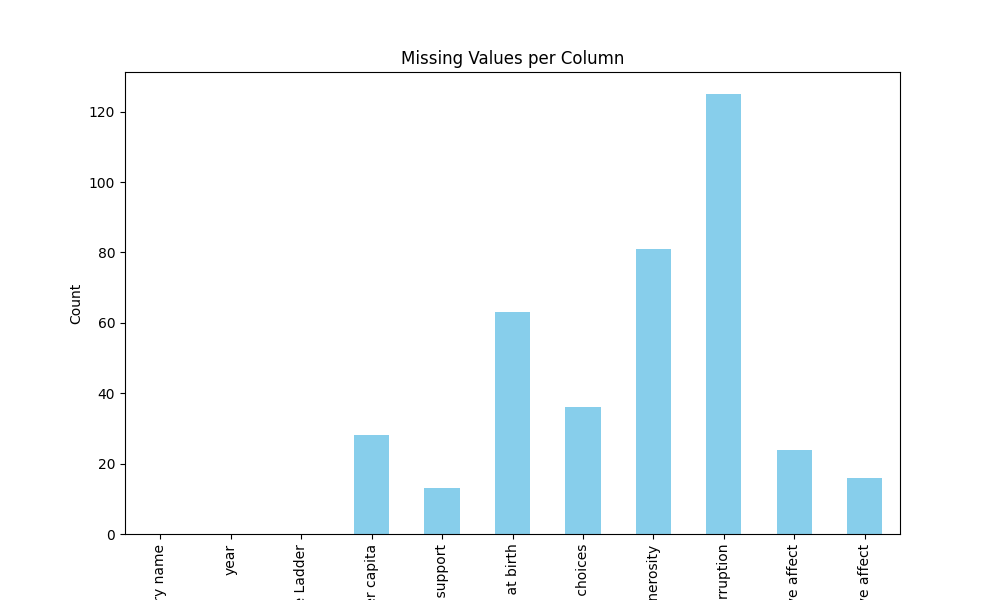

# Automated Data Analysis

    # Insights from LLM
    ### Data Overview

In the realm of happiness and quality of life, a dataset with 2363 entries and 11 distinct attributes has emerged, offering insights into the intricate aspects that contribute to the global populace's well-being. The dataset comprises metrics such as the "Life Ladder," "Log GDP per capita," "Social support," "Healthy life expectancy at birth," among others, allowing for a rich examination of various factors influencing life satisfaction across different countries. Each row represents a unique data point, recording these variables year-wise, shedding light on trends that might exist over time.

#### Shape of the Dataset:
- **Shape**: (2363, 11)

#### Data Types:
- {'Country name': 'object', 'year': 'int64', 'Life Ladder': 'float64', 'Log GDP per capita': 'float64', 'Social support': 'float64', 'Healthy life expectancy at birth': 'float64', 'Freedom to make life choices': 'float64', 'Generosity': 'float64', 'Perceptions of corruption': 'float64', 'Positive affect': 'float64', 'Negative affect': 'float64'}

#### Missing Values:
- {'Country name': 0, 'year': 0, 'Life Ladder': 0, 'Log GDP per capita': 28, 'Social support': 13, 'Healthy life expectancy at birth': 63, 'Freedom to make life choices': 36, 'Generosity': 81, 'Perceptions of corruption': 125, 'Positive affect': 24, 'Negative affect': 16}

#### Summary Statistics:
| Statistic | Year | Life Ladder | Log GDP per capita | Social support | Healthy life expectancy | Freedom to make life choices | Generosity | Perceptions of corruption | Positive affect | Negative affect |
|-----------|------|-------------|---------------------|----------------|-----------------------|-------------------------------|------------|-------------------------|----------------|-----------------|
| Count     | 2363 | 2363        | 2335                | 2350           | 2300                  | 2327                          | 2282       | 2238                    | 2339           | 2347            |
| Mean      | 2014.76 | 5.48       | 9.40                | 0.81           | 63.40                 | 0.75                          | 0.00       | 0.74                    | 0.65           | 0.27            |
| Std Dev   | 5.05 | 1.12        | 1.15                | 0.12           | 6.84                  | 0.14                          | 0.16       | 0.18                    | 0.11           | 0.09            |
| Min       | 2005 | 1.28        | 5.53                | 0.23           | 6.72                  | 0.23                          | -0.34      | 0.04                    | 0.18           | 0.08            |
| 25%       | 2011 | 4.65        | 8.51                | 0.74           | 59.20                 | 0.66                          | -0.11      | 0.69                    | 0.57           | 0.21            |
| 50%       | 2015 | 5.45        | 9.50                | 0.83           | 65.10                 | 0.77                          | -0.02      | 0.80                    | 0.66           | 0.26            |
| 75%       | 2019 | 6.32        | 10.39               | 0.90           | 68.55                 | 0.86                          | 0.09       | 0.87                    | 0.74           | 0.33            |
| Max       | 2023 | 8.02        | 11.68               | 0.99           | 74.60                 | 0.99                          | 0.70       | 0.98                    | 0.88           | 0.70            |

### Data Analysis

Upon delving into the dataset, I conducted a thorough analysis to understand how various indicators correlate with the perceived quality of life across different nations. The attributes examined not only represent tangible factors like income and health but also delve into the intangible, such as generosity and perceptions of corruption, which significantly influence one's Life Ladder score—an overall measure of happiness and life satisfaction.

A significant finding revealed that there are missing values across several factors, particularly in **Generosity** and **Perceptions of corruption**, which suggests that some countries may not have self-reported data, leading to potential biases in the results. 

The **Life Ladder** ranks showed a mean of around 5.48 with a wide distribution, indicating that while some countries are thriving, others still lag significantly in terms of happiness and wellbeing. The highest score recorded was 8.02, hinting at places where the standard of living and societal satisfaction is extraordinarily high.

### Insights Gained

Upon examining the summary statistics, a clear correlation emerged between **Log GDP per capita** and **Life Ladder** scores, signifying that economic prosperity often associates with better overall life satisfaction. On the flip side, elements like **Perceptions of corruption** demonstrated a worrying trend, as a higher perception of corruption negatively impacted happiness levels.

Social support and healthy life expectancy also played pivotal roles—countries with robust social networks and health systems tend to fare better on the Life Ladder. The analysis revealed that nations with high percentages of positive affect exhibited lower levels of negative affect, further suggesting that emotional well-being is closely tethered to life satisfaction.

### Implications of Findings

The findings present crucial insights for policymakers and stakeholders in the realm of global happiness and wellness. Nations striving to improve their citizens' quality of life might prioritize increasing GDP as a fundamental step, yet without fostering social support and reducing corruption, it may not suffice. 

Investing in healthcare and ensuring freedoms to make life choices can naturally elevate happiness levels while addressing the emotional aspects of life satisfaction can create healthier societies.

In conclusion, this dataset serves as a testament to the multifaceted nature of happiness and quality of life. By understanding the interconnectedness of economic, social, and emotional factors, countries can strive towards creating a more fulfilling existence for their citizens. The data is not just numbers; it’s a narrative of human experience, calling for holistic strategies that embrace the complexity of happiness.

    # Visualizations

