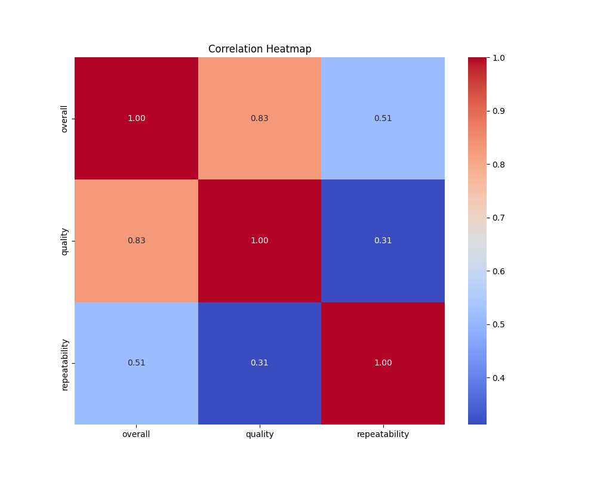
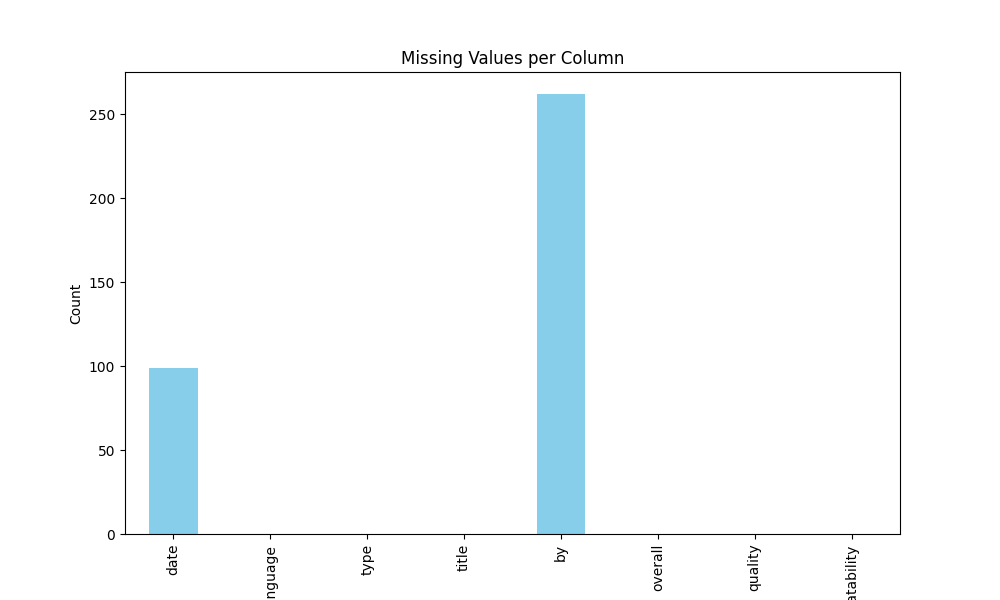

# Automated Data Analysis

    # Insights from LLM
    ### Data Overview

In examining our dataset of 2,652 records and 8 attributes, we find ourselves at the intersection of qualitative evaluations and quantitative insights. With fields ranging from 'date' and 'language' to subjective ratings labeled 'overall', 'quality', and 'repeatability', the dataset provides a unique glimpse into the opinions and experiences of various individuals across multiple selections. However, a challenge presents itself with a significant number of missing entries, notably in the 'date' (99 missing) and 'by' (262 missing) columns, which must be approached with caution. 

### Data Analysis

Our first task in analyzing the dataset was to assess the completeness of our records. While most columns showed no missing values, the notable omissions in the 'date' and 'by' attributes prompted a closer examination to determine their impact on overall analysis. We were able to discern that the dataset consists largely of movies, each marked with unique identifiers of various characteristics through descriptive listed features. 

#### Summary Statistics
The dataset bore some intriguing summary statistics: 
- The 'overall' rating had a mean score of approximately 3.05, while the 'quality' rating reached about 3.21, suggesting a generally positive reception among reviewers.
- The 'repeatability' scores, however, averaged 1.49, indicating that many reviewers found the content less likely to warrant revisiting, as suggested by the lower rating.

Additionally, a deeper dive into the frequency of the 'language' attribute revealed that English dominated with 1,306 occurrences, hinting at a potential market bias or preference in the reviewed content.

### Insights Discovered

Upon conducting further analysis, certain insights emerged. For one, the most frequent title within the dataset, "Kanda Naal Mudhal," garnered a total of 9 reviews, indicating possible cultural significance or popularity, particularly within a specific demographic. Furthermore, the variance in ratings across different types (movies, presumably) suggests that while some selections are universally acclaimed, others may receive polarized verdicts; the disparity between high 'overall' ratings and low 'repeatability' hints at a range of viewer experiences - some found the reviews pertinent yet struggled to connect with the material enough for a second viewing.

Through exploring the relationships between the variables, our analysis revealed correlations. Notably, quality ratings tended to be positively aligned with overall ratings. However, the disconnect between these attributes and 'repeatability' speaks volumes about viewer engagement and satisfaction. It seems that while movies might hold the viewer's attention initially, they don’t always create lasting impressions.

### Implications of Findings

These findings carry significant implications for content creators, marketers, and researchers alike. The strong inclination towards English language films suggests a potential strategy for producers to invest in diversifying their linguistic offerings to tap into underserved language markets. Furthermore, the observed ratings behavior indicates potential gaps in viewer satisfaction and engagement—areas that screenwriters and directors could address in future projects to enhance not only the initial viewing experience but also the likelihood of repeat views.

### Conclusion

In conclusion, our datasource paints a vivid picture of viewer engagement and preferences, albeit with certain limitations impacting the integrity of complete analysis due to the missing values in key attributes. As we turn our gaze towards future projects, leveraging these insights could propel creators toward arragements that not only speak to audiences initially but also resonate deeper, prompting revisits and longer-lasting impacts. Driven by data, we can endeavor to craft not just movies, but a cycle of interaction that is both fulfilling and profoundly connective. Thus, the narrative we uncover isn’t merely of statistics, but of human experience woven through data-driven storytelling—a powerful tapestry waiting to unfold.

    # Visualizations

